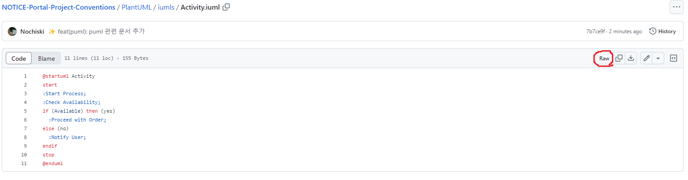

# PlantUML
PlantUML은 UML 다이어그램을 텍스트 기반으로 생성할 수 있는 도구로, 다양한 UML 다이어그램을 간단한 문법으로 작성할 수 있는 장점이 있습니다. PlantUML의 핵심은 문법이 매우 간단하여 복잡한 소프트웨어 설계 작업을 시각적으로 표현하는 데 효과적이라는 점입니다. PlantUML은 다양한 유형의 UML 다이어그램을 지원하며, 그중 대표적인 다이어그램 유형은 다음과 같습니다:

- **클래스 다이어그램** - 시스템 내의 클래스들 간의 관계를 시각화하는 데 사용됩니다.
- **시퀀스 다이어그램** - 객체들 간의 상호작용을 시간의 흐름에 따라 표현합니다.
- **유스케이스 다이어그램** - 시스템 사용자와 그들이 수행할 수 있는 동작을 나타냅니다.
- **상태 다이어그램** - 객체나 시스템의 상태 변화를 표현합니다.
- **활동 다이어그램** - 시스템 내에서 동작 흐름을 나타내며, 절차와 동작의 흐름을 시각화합니다.
- **컴포넌트 다이어그램** - 시스템의 물리적 구성 요소와 그들 간의 관계를 나타냅니다.


## Install
PlantUML의 설치를 위해서는 **Java**와 **Graphviz**가 필요합니다. 설치 방식은 운영체제별로 상이하며, 이 문서는 Windows를 기준으로 설명합니다.

### Windows
1. [자바](https://www.java.com/ko/download/ie_manual.jsp?locale=ko)를 설치합니다.
2. [graphviz-dot](https://plantuml.com/ko/graphviz-dot)을 설치합니다.
3. [plantuml.jar](https://plantuml.com/ko/download)를 설치 후 컴퓨터 특정 경로에 저장합니다.
   1. eg. ```"C:\plantUML\plantuml-mit-1.2024.7.jar"```
4. 환경변수를 세팅합니다.
   1. 제어판 > 시스템 > 고급 시스템설정 > 환경변수 클릭
   2. **사용자 변수**에JAVA_JRE_HOME 이라는 이름으로 jre파일 경로 입력
      1. eg. ```C:\Program Files\Java\jre1.8.0_421```
   3. **시스템 변수**의 Path 편집 클릭
      1. **새로 만들기** 클릭 후 Graphviz-dot 설치 경로 추가 
         1. eg. ```C:\Program Files\Graphviz\bin```
      2. ```%JAVA_JRE_HOME%\bin``` 추가
   4. 컴퓨터 재부팅
5. VSCode에서 ***PlantUML by jebbs*** 익스텐션 찾아서 설치합니다.
   1. ```Ctrl + ,```를 눌러 설정 창 열기
   2. 검색창에 ```plantuml```을 입력하여 관련 설정 항목을 확인
   3. PlantUML: Jar 설정 항목에 plantuml.jar 파일의 경로를 입력. 
      1. eg, ```C:/path/to/plantuml.jar```.
   
## 사용 방법
1. ```.puml``` 파일을 생성해 예시를 입력 후 ```Alt+D```를 눌러 프리뷰를 확인합니다.


## 예시
### 시퀀스 다이어그램
```iuml 
@startuml
Alice -> Bob: Hello Bob, how are you?
Bob --> Alice: I am good thanks!
Alice -> Bob: Let's meet at 5pm
Bob --> Alice: Sure, see you then!
@enduml
```


**결과**: 

Alice가 Bob에게 메시지를 보내고, Bob이 응답하는 시퀀스가 그려집니다.


### 클래스 다이어그램
```
@startuml
class Animal {
  + String name
  + void makeSound()
}

class Dog {
  + void bark()
}

Animal <|-- Dog
@enduml
```


**결과**: 

Animal 클래스를 상속받는 Dog 클래스가 포함된 클래스 다이어그램을 생성합니다.

### 활동 다이어그램
```
@startuml
start
:Start Process;
:Check Availability;
if (Available) then (yes)
  :Proceed with Order;
else (no)
  :Notify User;
endif
stop
@enduml
```


**결과**: 

활동 다이어그램으로 프로세스의 시작, 조건 검사, 프로세스 종료를 나타냅니다.

### 객체 다이어그램
```
@startuml
object Car {
  model = "Tesla Model S"
  year = 2023
  color = "Red"
}

object Owner {
  name = "Alice"
  age = 30
}

Car --> Owner : owned by
@enduml
```


**결과**: 

객체 다이어그램으로 Car와 Owner 객체를 정의하고 관계를 표현합니다.

### 컴포넌트 다이어그램 
```
@startuml
package "Web Application" {
  [Browser] --> [Web Server]
  [Web Server] --> [Database]
}
@enduml
```


**결과**:

컴포넌트 다이어그램으로 웹 애플리케이션의 브라우저, 웹 서버, 데이터베이스 간의 관계를 표현합니다.

## 마크다운에 삽입하기
```http://www.plantuml.com/plantuml/proxy```를 사용하여 온라인상에서 puml을 이미지로 랜더링할 수 있습니다.

### 예시
``````

- 이때 ```src=``` 이후 의 주소는 실제 유효한 파일의 URL이어야합니다.
  
- 만일 파일을 github에 같이 저장할 시, 파일의 URL은 단순 폴더의 위치가 아닌 RAW 버튼을 눌렀을 때 나오는 URL을 사용해야합니다.
- 또한 ```cache=no``` 옵션을 통해 항상 깃헙에 최신으로 커밋된 버전의 이미지를 랜더링 할 수 있도록 합니다.
