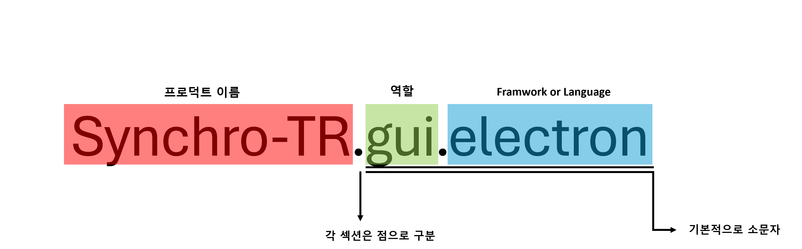

# Portal301 Project Repository Namang convention

Portal Project는 다음과 같은 Naming Convention을 따릅니다.

기본적으로 소문자를 지향하며 프로덕트 이름의 경우에는 대문자도 자유롭게 허용    
## 예시    
### Synchro-TR.gui.electron    
### Synchro-TR.robot.py    
### Synchro-TR.tracker.unity    
